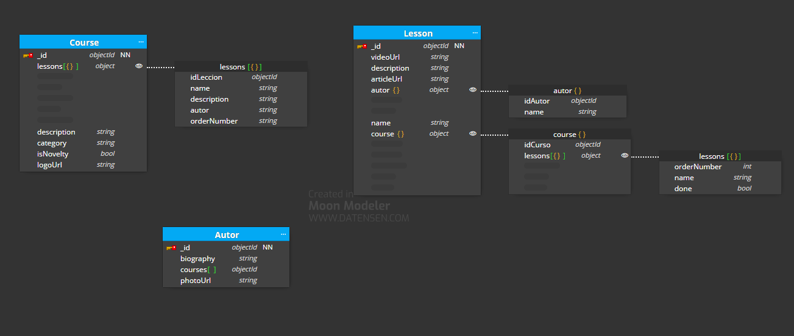

# BackEndModulo1

# Caso básico

Este es el caso básico: 

Lo que he tenido en cuenta: 

- He creado la colección "Course", he tenido las siguientes consideraciones: 
    - He embebido la información necesaria de las lecciones, en la cual, a su vez, he embebido el nombre del autor.
    - He creado el campo calculado isNovelty para considerarlo novedad. 
- He creado la colección "Lesson", he tenido en cuenta las siguientes consideraciones: 
    - He embebido la información del autor e id para poder navegar a su biografía.
    - He embebido la información del curso para poder mostrar el índice.

- He creado la colección "Autor": 
    - Se guardan los ids de los cursos. Supongo que no es necesario embeber la información de los cursos ya que no se va a consultar con frecuencia. 
