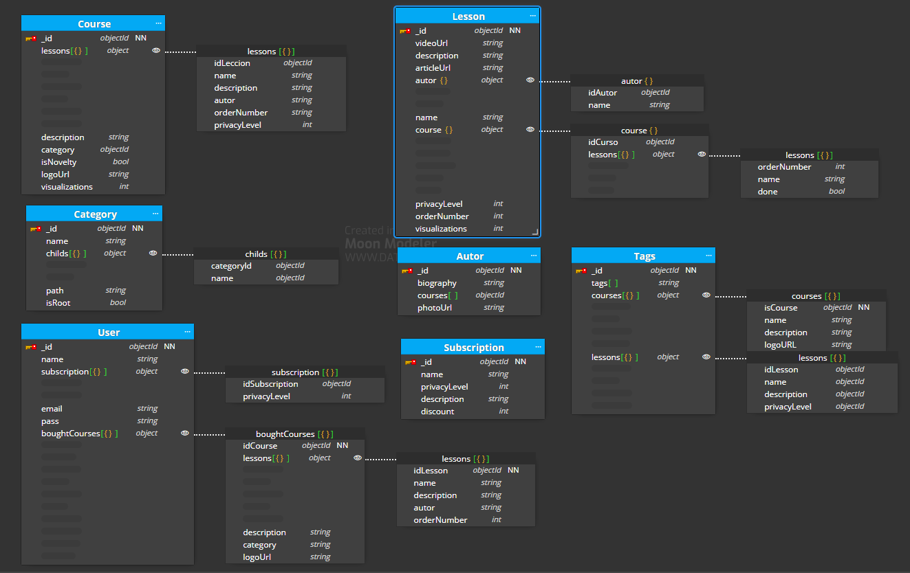

# BackEndModulo1

# Caso desafio

Este es el caso desafio: 

Lo que he tenido en cuenta: 

- He usado el subset pattern para añadir los cursos comprados en la colección Usuario. 
- He usado el bucket pattern para crear la colección "Tags" en la que se irán guargando agrupaciones de cursos según los tags que se le asignen.
- He añadido un campo calculado de visualizaciones en las colecciones "Course" y "Lessons" que actualizarán acorde con el patrón de aproximación.
